# 分组数据

## 一、为什么需要数据分组

先来看几个问题：以`products`表为例，

1. 假设我们需要找出`products`表中的所有供应商，我们可以怎样做？
    1. 非分组方式(用`DISTINCT`关键字实现)：`SELECT DISTINCT vend_id FROM products;`
    2. 分组实现：`SELECT vend_id FROM products GROUP BY vend_id;`
2. 假设我们需要统计某一个供应商提供的产品数，我们可以这样写SQL：
`SELECT COUNT(*) AS prod_num FROM products WHERE vend_id='DLL01';`
3. 现在，我们需要统计`products`表中各个供应商提供的产品数。那么，用2的方法可行吗？显然不可行，接下来看看如何使用分组来达到统计目的：
`SELECT vend_id, COUNT(*) AS num_prods FROM products GROUP BY vend_id;`
查询结果如下(`GROUP BY`即为分组关键字)：

  
所以，简单总结就是`GROUP BY`的作用就是对数据表中的数据进行分类汇总并可以使用聚合函数进行统计分析。

## 二、什么是数据分组

在SQL查询中，分组就是将具有某种共性的数据聚集在一起，以便对数据进行统计分析。

## 三、分组操作

### 1. 创建分组

分组是通过`GROUP BY`关键字完成的，下面是简单的例子：
**示例1**：统计`products`表中各个供应商提供的产品数：`SELECT vend_id, COUNT(*) AS num_prods FROM products GROUP BY vend_id;`
查询结果如下(`GROUP BY`即为分组关键字)：

**查询语句分析**：这是最基本的用法。通过查询结果图可以看到，有别于普通的`SELECT`查询，查询所得结果是按照`GROUP BY`的字段`vend_id`进行展示的，而统计所得结果`num_prods`统计的是分组后每组中的记录数。
  
**示例2**：统计`products`中按照`vend_id`和`prod_price`分组的每组的记录数：`SELECT vend_id, prod_price, COUNT(*) AS num_prods FROM products GROUP BY vend_id, prod_price;`，查询结果如下：
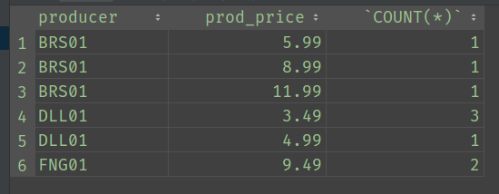

以上只是`GROUP BY`的简单使用，下面是`GROUP BY`相关的规则：
**使用`GROUP BY`时需注意的相关规则**

- **如果SQL中存在`WHERE`子句，则`GROUP BY`要在`WHERE`之后**
  - **解析**：这与`WHERE`子句的特点相关，`WHERE`子句是针对数据表中原有的行(或记录)进行过滤，过滤所得结果仍然是行，正因过滤的是行，因此`WHERE`子句中只能使用数据表中原有的列名，而不能使用别名；`GROUP BY`是对行进行针对性分组，所得结果是多个组，每个组由符合`GROUP BY`要求(具有相同值的列)的行组成。因此，若是`WHERE`在`GROUP BY`之后执行，则会直接报错，因为`WHERE`过滤的数据不再是行。另，也可以将`GROUP BY`所得的组视作多个虚拟表。
  - **示例**：统计各个厂商生产的产品中`prod_price`大于`4`的数量：`SELECT vend_id AS producer, COUNT(*) FROM products WHERE prod_price > 4 GROUP BY vend_id;`，查询结果如下：
  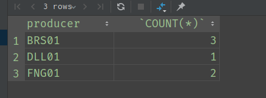
- **若SQL中存在`ORDER BY`子句，则`GROUP BY`要在`ORDER BY`之前**
  - **解析**：这是`SELECT`中的语法规则，`ORDER BY`在后续会给出相应的详细说明。
  - **示例**：以`vend_id`为分组依据，按照分组中`prod_price`的平均数给出分组间的排序(降序)：`SELECT vend_id AS producer, AVG(prod_price) AS price_avg FROM products GROUP BY vend_id ORDER BY price_avg DESC;`，查询结果如下：
  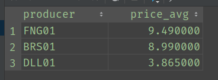
- **除聚合计算语句外(如`COUNT`)，`SELECT`中的每个列都必须在`GROUP BY`子句中给出**
  - **解析**：这个可以根据MySQL语句的执行顺序理解，详情请参考文章：[MySQL中查询语句中各个子句的语法顺序与各个子句的执行顺序](../MySQL中查询语句中各个子句的语法顺序与各个子句的执行顺序.md)
- **`GROUP BY`子句可以包含任意数目的列。这使得能对分组进行嵌套，为数据分组提供更细致的控制**
  - **解析**：暂未理解及实践
- **如果在GROUP BY子句中嵌套了分组，数据将在最后规定的分组上进行汇总。换句话说，在建立分组时，指定的所有列都一起计算（所以不能从个别的列取回数据）**
  - **解析**：暂未理解及实践
- **GROUP BY子句中列出的每个列都必须是检索列或有效的表达式（但不能是聚集函数）。如果在SELECT中使用表达式，则必须在GROUP BY子句中指定相同的表达式。不能使用别名**
  - **解析**：暂未理解及实践表达式相关的操作
- **如果分组列中具有NULL值，则NULL将作为一个分组返回。如果列中有多行NULL值，它们将分为一组**
  - **解析**：实际上就是将`NULL`作为一类值进行分组，详见示例
  - **示例**：从生产商`vendors`中按照`vend_state`进行分组并统计：`SELECT vend_state, COUNT(*) FROM vendors GROUP BY vend_state;`，查询结果如下：
  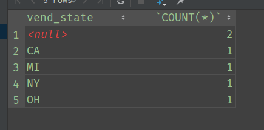

**`WITH ROLLUP`的使用**
`WITH ROLLUP`是基于数据统计结果(如聚集函数)的基础上进行再一次数据汇总的子句，其主要作用是对每一列进行数据汇总（数值相加）。对于使用了聚集函数的列的值会对该列进行累加统计，对于无法汇总的列，其值为`NULL`。
**示例**：`SELECT vend_id AS producer, COUNT(*) FROM products WHERE prod_price > 4 GROUP BY vend_id WITH ROLLUP;`
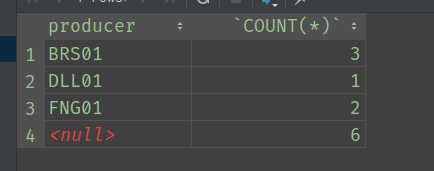

### 2. 过滤分组

#### 概念

所谓过滤分组，就是对`GROUP BY`所得的分组按照特定的条件进行筛选，过滤分组需要使用`HAVING`子句。
  
**示例**：

- 过滤`orders`表中，以顾客`cust_id`分组，订单数大于或等于2的顾客及其订单数：`SELECT cust_id, COUNT(*) AS orders_count FROM orders GROUP BY cust_id HAVING orders_count >= 2;`，查询结果如下：
  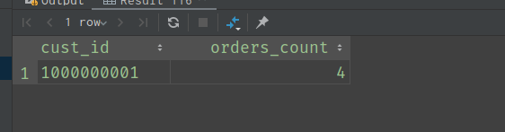
- 查询`products`中`prod_price`大于7，并按照`vend_id`进行分组的数据：`SELECT vend_id, COUNT(*) FROM products WHERE prod_price > 7 GROUP BY vend_id;`，查询结果如下：
  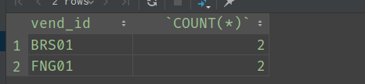

#### `WHERE`与`HAVING`

- **相同点**

  1. 二者对操作符、通配符的使用规则相同

- **不同点**

  1. `WHERE`中只能使用列名，不能使用别名；而`HAVING`可以。
  2. `WHERE`过滤行，`HAVING`过滤分组
  3. `WHERE`在分组`GROUP BY`前执行，对行进行过滤；`HAVING`在分组后，对分组进行过滤

### 3. 分组与排序

#### `GROUP BY`中的组内行顺序

实际上，在使用`GROUP BY`时，我们会发现组内的行是会按照某列或某几列的值进行升序排序的。但是，需要注意的是，这并不是`GROUP BY`的规则。但是，这样的排序是充满了不确定性的，因此我们不能直接使用`GROUP BY`的排序结果，而应该使用`ORDER BY`进行明确的排序后的结果。
  
**`GROUP BY`中的排序**

- `SELECT vend_id, prod_price, COUNT(*) FROM products GROUP BY prod_price, vend_id;`，查询结果如下：
  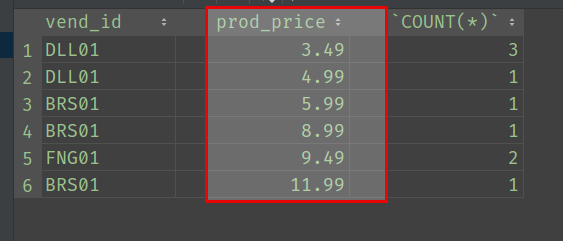
- `SELECT vend_id, prod_price, COUNT(*) FROM products GROUP BY vend_id, prod_price;`，查询结果如下：
  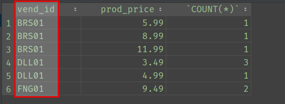

可以看到，在上面的两个查询语句中，唯一的区别在于`GROUP BY`后的字段顺序不一样，因此在查询结果中的记录顺序也不一样。

#### `ORDER BY`中的组内行顺序

- `SELECT vend_id, prod_price FROM products ORDER BY vend_id, prod_price;`，查询结果如下：
  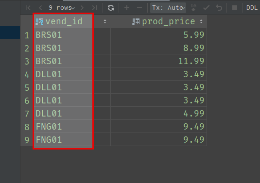
- `SELECT vend_id, prod_price FROM products ORDER BY prod_price, vend_id;`，查询结果如下：
  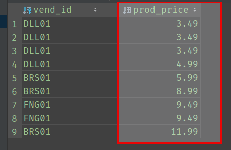

可以看到，以上两个查询语句中按照排序字段顺序进行排序，并且显示所有记录的排序。

#### `GROUP BY`与`ORDER BY`的对比

| `GROUP BY` | `ORDER BY` |
| :--------- | :--------- |
| 分组中按照其后的第一个列名排序 | 按照其后的列进行排序 |
| 列字段与`SELECT`要保持一致，即`SELECT`中有的，`GROUP BY`必须有 | 排序的列可以不出现在`SELECT`中 |

##### 示例对比

查找总计订单价格大于等于50的订单的订单号及总计订单价格

- **仅使用`GROUP BY`**：`SELECT order_num, SUM(quantity * item_price) AS ordertotal FROM order_items GROUP BY order_num HAVING ordertotal >= 50;`，结果如下：
  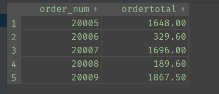
- **使用`GROUP BY`并通过`ORDER BY`对订单总价格排序**：`SELECT order_num, SUM(quantity * item_price) AS ordertotal FROM order_items GROUP BY order_num HAVING ordertotal >= 50 ORDER BY ordertotal;`，结果如下：
  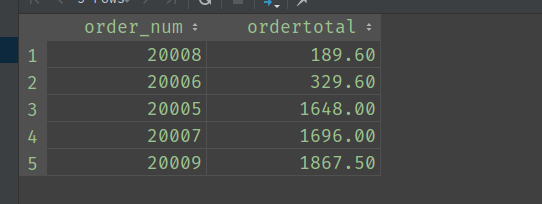

显然，如果仅仅用`GROUP BY`，是无法做到对订单总价格排序的，因为`GROUP BY`的排序仅仅是对其后的列进行排序，而无法对统计结果进行排序。
