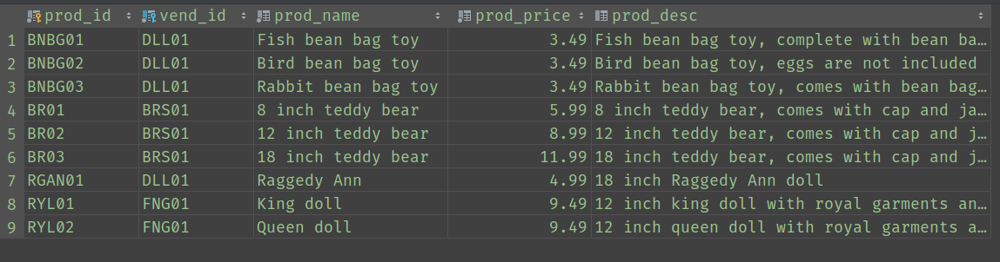
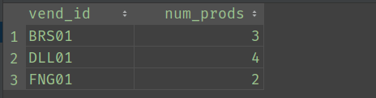

# 分组数据

## 一、为什么需要数据分组

先来看几个问题：以`products`表为例，

1. 假设我们需要找出`products`表中的所有供应商，我们可以怎样做？
    1. 非分组方式(用`DISTINCT`关键字实现)：`SELECT DISTINCT vend_id FROM products;`
    2. 分组实现：`SELECT vend_id FROM products GROUP BY vend_id;`
2. 假设我们需要统计某一个供应商提供的产品数，我们可以这样写SQL：
`SELECT COUNT(*) AS prod_num FROM products WHERE vend_id='DLL01';`
3. 现在，我们需要统计`products`表中各个供应商提供的产品数。那么，用2的方法可行吗？显然不可行，接下来看看如何使用分组来达到统计目的：
`SELECT vend_id, COUNT(*) AS num_prods FROM products GROUP BY vend_id;`
查询结果如下(`GROUP BY`即为分组关键字)：

  
所以，简单总结就是`GROUP BY`的作用就是对数据表中的数据进行分类汇总并可以使用聚合函数进行统计分析。

## 二、什么是数据分组

在SQL查询中，分组就是将具有某种共性的数据聚集在一起，以便对数据进行统计分析。

## 三、分组操作

### 1. 创建分组

分组是通过`GROUP BY`关键字完成的，下面是一个简单的例子：
统计`products`表中各个供应商提供的产品数：`SELECT vend_id, COUNT(*) AS num_prods FROM products GROUP BY vend_id;`
查询结果如下(`GROUP BY`即为分组关键字)：

**查询语句分析**：这是最基本的用法。通过查询结果图可以看到，有别于普通的`SELECT`查询，查询所得结果是按照`GROUP BY`的字段`vend_id`进行展示的，而统计所得结果`num_prods`统计的是分组后每组中的记录数。
  
以上只是`GROUP BY`的简单使用，下面是`GROUP BY`相关的规则：

- 如果SQL中存在`WHERE`子句，则`GROUP BY`要在`WHERE`之后
  - **解析**：这与MySQL语句的执行顺序相关，`WHERE`子句是针对数据表中原有的行(或记录)进行过滤，过滤所得结果仍让是行；`GROUP BY`是对行进行针对性分组，所得结果是多个组，每个组由符合`GROUP BY`要求(具有相同值的列)的行组成。因此，若是`WHERE`在`GROUP BY`之后执行，则会直接报错，因为`WHERE`过滤的数据不再是行。另，也可以将`GROUP BY`所得的组视作多个虚拟表。
- 若SQL中存在`ORDER BY`子句，则`GROUP BY`要在`ORDER BY`之前
  - **解析**：
- 除聚合计算语句外(如`COUNT`)，`SELECT`中的每个列都必须在`GROUP BY`子句中给出。
- 

### 2. 过滤分组

### 3. 分组与排序

### 4. `SELECT`子句排序
