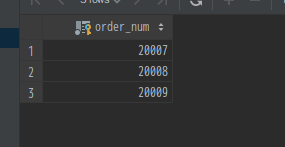
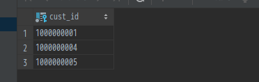
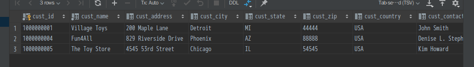
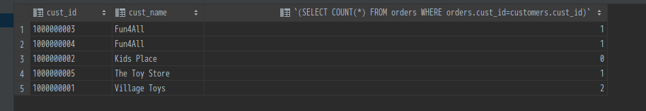

# 使用子查询

## 为什么需要子查询

简单地说，在一条查询语句中，所需的数据在单张表无法满足时，子查询可以作为获取其他表数据的方式之一。

## 什么是子查询

所谓子查询，就是嵌套在另一个查询中的查询。最常见的就是`SELECT`查询，还可以是`INSERT`, `UPDATE`或`DELETE`。另外，子查询中还可以嵌套子查询，而且无数量限制，但是在使用子查询时往往需要考虑其使用的必要及查询的效率等问题。

## 子查询可以做什么及如何使用子查询

### 将子查询结果作为过滤条件，利用子查询进行过滤

**查询需求**：列出订购了物品`BNBG01`的所有客户。
**查询分析**：从查询需求看，查询中涉及两个实体，一个是客户，另一个时物品，而客户与物品间的联系是订单。因此，该查询涉及三张表。那么我们可以分别看看不使用子查询和使用子查询时是如何达到查询目的的：

- **不使用子查询**：不使用子查询，需要如下三个步骤：
    1. 查询含有物品`BNBG01`的所有订单：`SELECT order_num FROM order_items WHERE prod_id='BNBG01';`
    
    2. 从查询所得的订单中获取所有客户ID：`SELECT cust_id FROM orders WHERE order_num IN (20007, 20008, 20009);`
    
    3. 从客户表中根据客户ID查询客户信息：`SELECT * FROM customers WHERE cust_id IN ('1000000001', '1000000004', '1000000005');`
    
- **使用子查询**：

    ```sql
    SELECT *
    FROM customers
    WHERE cust_id IN (
        SELECT cust_id FROM orders
        WHERE order_num IN (
            SELECT order_num FROM order_items
            WHERE prod_id='BNBG01'
        )
    );
    ```

    

**子查询分析**：在含有子查询的sql中，子查询总是由内向外执行的。也就是说，上面的子查询步骤为：

```sql
# 1. 从order_items中查找order_num
SELECT order_num FROM order_items WHERE prod_id='BNBG01';
# 2. 从orders中查找cust_id
SELECT cust_id FROM orders WHERE order_num IN (order_num查询结果集...);
# 3. 从customers中查找客户信息
SELECT * FROM customers WHERE cust_id IN (cust_id查询结果集...);
```

而从以上的子查询中我们可以得出以下规则：

- 在`SELECT`语句中，子查询时自内向外处理的
- 子查询的查询列与外部条件的列必须一致
- 子查询中可以嵌套子查询，并且没有限制，但是考虑到查询效率问题，则不推荐无限嵌套。

那么除了利用子查询的查询结果作为过滤条件外，还可以利用子查询做什么呢？

### 将子查询结果作为数据统计字段

使用子查询的另一方法时创建计算字段。具体示例：统计`customers`中每个客户的订单数

```sql
SELECT
  cust_id,
  cust_name,
  (SELECT COUNT(*) FROM orders WHERE orders.cust_id=customers.cust_id)
FROM customers
ORDER BY cust_name;
```



**查询分析**：值得注意的是，在该子查询中使用了**完全限定列名**用以区分不同表的列。
