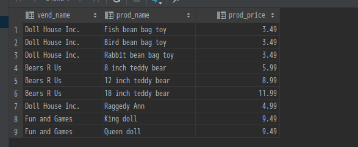
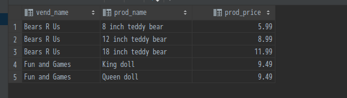
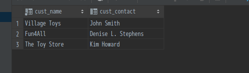

# 联结表

## 为什么要使用联结

在了解为什么需要使用联结前，需要先了解MySQL中的关系表。简单地说，所谓关系表，就是指两张存在关联关系的数据表，它们的关系通过其中一张表的主键作为另一张表的外键进行关联。关系表的存在，解决了大量的数据冗余问题，提升了数据表的灵活性。基于关系表，那么如果我们需要进行跨表查询时，如果想通过一条sql语句即可实现跨表查询，我们就可以使用联结这种方式实现。当然，除了联结，我们还可以使用子查询。
另外，相比于子查询，联结表能够有效简化sql语句。

## 什么是联结

所谓联结，就是在同一条`SELECT`语句中使用特殊的语法或关键字关联多张表的数据，这就是联结，联结所产生的数据可以视为一张虚拟表，其中的数据是多张表数据组合而成的。

## 如何创建联结

联结的创建非常简单，只需在`FROM`子句中给出多个表即可。但是，仅仅是`FROM`子句是不够的，还需要`WHERE`子句对联结的多个表的行进行逻辑匹配。若是没有`WHERE`子句进行约束，则会生成[笛卡尔集](https://baike.baidu.com/item/%E7%AC%9B%E5%8D%A1%E5%B0%94%E9%9B%86)。而笛卡尔集并非我们想要的数据，因此要注意不能漏了过滤条件`WHERE`。

**一个简单的例子**：
`SELECT vend_name, prod_name, prod_price FROM vendors, products WHERE vendors.vend_id=products.vend_id ORDER BY vend_name, prod_name;`
在该sql语句中，`SELECT`所查询的数据涉及两张表，`vend_name`属于`vendors`表，而`prod_name`和`prod_price`属于`products`表。另外，sql中使用了完全限定列名，是为了区分不同表中的同名列，用以消除具有二义性的列名。

### 内部联结

内部联结即基于两个表之间的某些列值的等值约束进行两个表间的行与行的联结，这种联结又称等值联结。前面使用`WHERE`子句约束所得的联结即为等值联结，而除了使用`WHERE`约束进行联结，还可以使用`INNER JOIN ... ON ...`进行等值联结。

**使用`INNER JOIN ON`**：
`SELECT vend_name, prod_name, prod_price FROM vendors INNER JOIN products ON vendors.vend_id=products.vend_id;`

  
使用这种语法，联结条件中使用`ON`进行指定，其效果与使用`WHERE`大致相同。另外，还可以使用`WHERE`进行其他条件过滤。示例如下：
`SELECT vend_name, prod_name, prod_price FROM vendors INNER JOIN products ON vendors.vend_id=products.vend_id WHERE prod_price > 5;`


### 联结多个表

sql中对于一条`SELECT`语句中联结的表的数量是没有限制的，但是联结过多的表会大大降低查询效率，因此不推荐联结不必要的表。

**示例**：

```sql
SELECT cust_name, cust_contact
FROM customers, orders, order_items
WHERE customers.cust_id=orders.cust_id AND
    order_items.order_num=orders.order_num AND
    prod_id='BNBG01';
```


