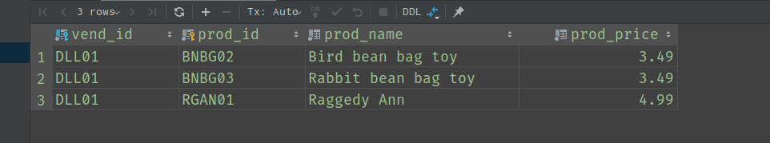
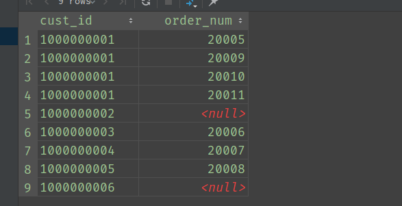
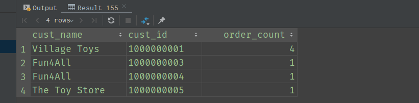

# 创建高级联结

## 使用表别名

在介绍高级联结之前需要首先介绍表别名。在前面的章节中已学了如何对列名进行别名设置，表别名的设置与列名设置相同。设置表别名主要是为了缩短SQL语句以及在单条`SELECT`语句中多次使用相同的表。

**示例**：

```sql
SELECT cust_name, cust_contact, c.cust_id
FROM customers AS c, orders AS o, order_items AS oi
WHERE c.cust_id=o.cust_id AND oi.order_num=o.order_num AND prod_id='TNT2';
```

从上面的SQL语句可以看出在`FROM`子句中设置的表别名在`SELECT`子句、`WHERE`子句中都用到了。其中很重要的一点是，在`WHERE`子句中也使用了表别名。在此之前我们提到过，`WHERE`子句中不能使用列别名。现在对比起来，这与SQL子句的执行顺序有关，详情请看文章[MySQL中查询语句中各个子句的语法顺序与各个子句的执行顺序](../MySQL中查询语句中各个子句的语法顺序与各个子句的执行顺序.md)。

## 各种类型的联结

在[Chapter 15：联结表](Chapter&#32;15：联结表.md)中，我们学习了内部联结。除了内部联结，还有自联结、自然联结和外部联结。下面分别介绍下自联结、自然联结和外部联结。

### 自联结

**自联结的使用场景**：在介绍自联结之前，首先看一个问题：从`products`表中查找出与`prod_id`为`BNBG01`的属于相同生产商的其他产品。
首先，如果不使用表联结，我们可以使用什么方式查询呢？子查询：

```sql
SELECT vend_id, prod_id
FROM products
WHERE vend_id=(SELECT vend_id FROM products WHERE prod_id='BNBG01') AND prod_id='BNBG01';
```



从子查询中可以看出，子查询中是从`products`表自身查找出`vend_id`的。那么，如果转为表联结的方式呢？

```sql
SELECT p1.vend_id, p1.prod_id
FROM products AS p1, products AS p2
WHERE p1.vend_id=p2.vend_id AND p2.prod_id='BNBG01' AND p1.prod_id!='BNBG01';
```

**(自联结概念)**从以上的查询方式使用的就是自联结，询结果与子查询相同。所以，从以上SQL语句来看，自联结就是同一个表联结自身。自联结通常用于替代从相同表中查询数据的子查询语句。那么，为什么要使用联结来替代子查询呢？原因是在处理表联结时多数时候要比子查询高效。

### 自然联结

所谓自然联结，指的是无需在SQL语句中显示指明表联结条件，由MySQL自己完成对表与表之间相同列的判断并进行相应的行匹配的这个过程。
**示例**：

```sql
SELECT c.cust_id, o.order_num, oi.item_price
FROM customers AS c NATURAL JOIN orders AS o NATURAL JOIN order_items AS oi;
```

通常，不推荐使用自然联结。

### 外部联结

外部联结对应的是内部联结。我们知道，内部联结又称为等值联结。在等值联结中，表之间的行存在一一对应关系，也就是说不会存在一张表中的一些行在另一张表中没有对应的行。相对的，外部联结产生的结果对应的就是在表联结过程中某些表会存在一些行在另一张表中没有连接的行。

**外部联结的使用**：外部联结分为两种，一种是`LEFT OUTER JOIN`，另一种是`RIGHT OUTER JOIN`。二者的区别在于其中的`LEFT`和`RIGHT`，`LEFT`指的是两个联结的表的左边的表会选择所有的行，`RIGHT`同理。

**示例**：

```sql
SELECT customers.cust_id, orders.order_num
FROM customers LEFT OUTER JOIN orders
on customers.cust_id = orders.cust_id;
```



如上图所示，我们使用的是`LEFT OUTER JOIN`，所以查询结果中存在`cust_id`对应了值为`NULL`的`order_num`。

## 在联结中使用聚集函数

我们知道，聚集函数通常用于统计数据。在单表数据统计中，我们可以使用`COUNT()`，`AVG()`等函数计算某一列。同样的，在表联结的情况下我们也是可以使用聚集函数的。

**示例**：检索所有客户及其对应的订单数
在前面的章节中，我们使用子查询实现，现在使用表联结实现：

```sql
SELECT c.cust_name, c.cust_id, COUNT(o.order_num) AS order_count
FROM customers AS c INNER JOIN orders AS o
ON c.cust_id=o.cust_id
GROUP BY c.cust_id;
```


