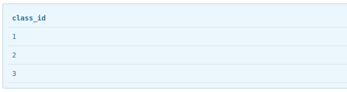

# 检索数据

**SELECT语句查询**：要使用SELECT查询数据，必须至少给出要查什么以及从哪里查

- 检索单个列：
  `SELECT 列名 FROM 数据表名;`，查询所得的数据是未排序数据
 
- 检索多个列：
  `SELECT 列1, 列2, 列3 FROM 数据表名;`，所得数据会按照查询语句中的字段顺序给出
 
- 检索所有列：
  `SELECT * FROM 数据表名;`，使用通配符`*`所得的结果中，列的出现顺序一般为表定义中出现的顺序，可通过`SELECT COLUMNS FROM 数据表名;`获取表定义的列的顺序及信息
 
- 对检索使用`DISTINCT`约束：
  使用`DISTINCT`来约束指定的列的值，使得检索所得的结果中至少有一列的值在每一行中是唯一的。具体示例如下：
  - 数据表students：
  
  
  - `DISTINCT`约束单列：`SELECT DISTINCT class_id FROM students;`，结果如下：
  
  **`DISTINCT`可以约束单列吗？**
  不能。无法使用`DISTINCT`约束多列值，达到预期的结果。
 
- `LIMIT`限制查询返回的结果数：
  - 用法1：`LIMIT return_amount`
    只限制返回结果数，以students表为例，查询学生信息并只返回5条：`SELECT * FROM students LIMIT 5;`
  - 用法2：`LIMIT return_amount OFFSET start_row_num`
    即为返回从第start_row_num行后的return_amount行记录：`SELECT * FROM students LIMIT 3 OFFSET 2;`。该种写法可能会出现因开始的行数过高而导致返回的记录数小于return_amount
  - 用法3`(已不支持)：LIMIT start_row_num` return_amount`
    该种写法容易让人误解，故已不再支持
 
- 使用完全限定的表名和列名：
  所谓完全限定，即明确指出数据表属于哪个数据库，列属于哪张数据表。假设`students`表属于`class`数据库，那么就有：`SELECT students.class_id FROM class.students;`。
  在何种情况下需要使用限定名？不同数据库的同名数据表，同一数据库的的不同数据表的同名列。
