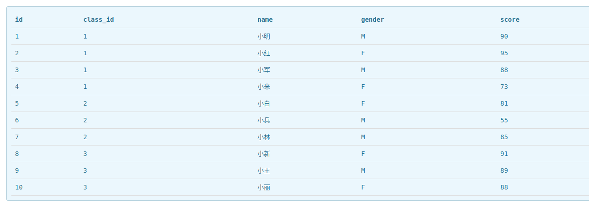

**`WHERE`的基础用法：`WHERE`子句用于对检索结果按照指定的条件进行过滤**
 
**数据表(提供数据)**

 
**`WHERE`的使用**：`SELECT * FROM students WHERE class_id=1;`
 
**`WHERE`子句操作符**
| 操作符 | 说明 |
| :-----: | :-------: |
| `=` | 等于 |
| `<>` | 不等于 |
| `!=` | 不等于 |
| `>` | 大于 |
| `>=` | 大于等于 |
| `<` | 小于 |
| `<=` | 小于等于 |
| `BETWEEN a AND b` | 介于a和b之间(包括a和b) |
| `IS NULL` | 为空值 |
 
由于`WHERE`的使用较为简单，因此仅记录需要注意的地方，其他操作符的示例不在列出：
  - 对字符串类型的列值过滤时，不区分大小写：例如`name='Johny'`、`name='johny'`或是`name='JOHNY'`等对于`WHERE`而言都会匹配到。`SELECT * FROM students WHERE name='JOHNY'`