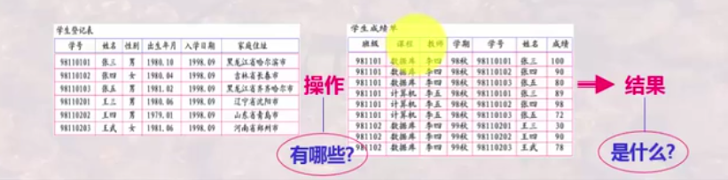
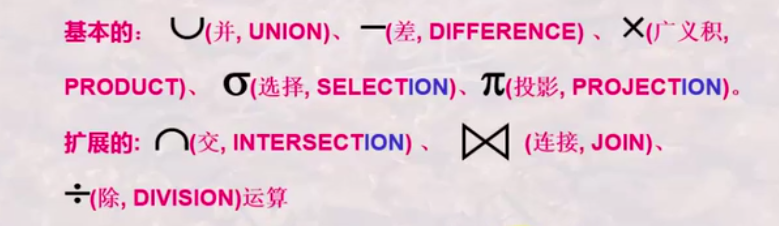
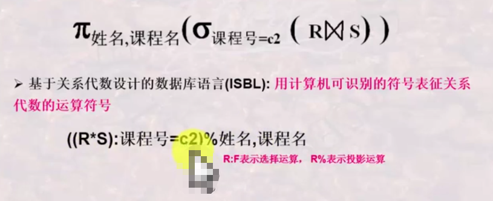
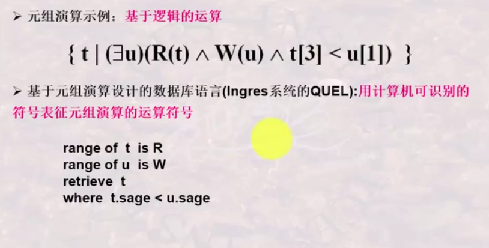
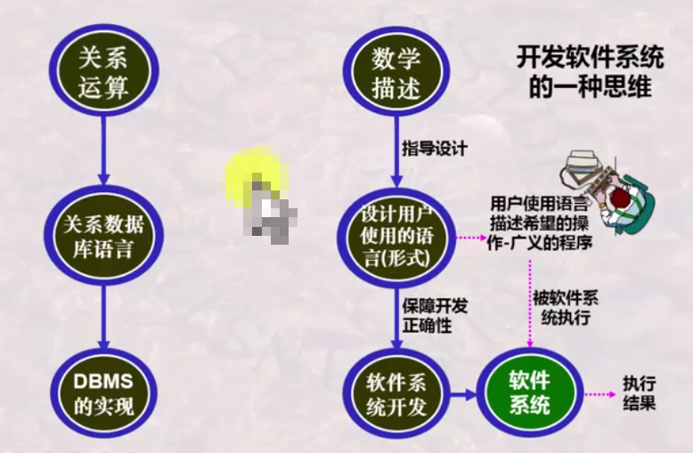

# 关系模型简述

## 1. 关系模型的提出

- 于1970年由E·F·Code提出
- 关系模型是从表(Table)及表的处理方式中抽象出来的数据模型，属于三大数据模型之一：
  - 层次模型
  - 网状模型
  - 关系模型
- 关系模型数据库的标准数据库语言称为SQL

## 2. 关系模型的研究内容

一个关系(Relation)就是一个Table。关系模型就是处理Table的，关系模型由三部分组成：

- **Table/Relation**：描述DB各种数据的基本结构形式。如：学生表、班级表
- **关系运算**：描述Table之间的各种操作
- **完整性约束**：描述关系运算所遵循的约束条件

简单说，就是研究关系模型下的Table如何描述、关系模型由哪些操作(关系运算)及其结果是什么、有哪些约束等。

## 3. 关系模型的三要素

- **基本结构**：Table/Relation，也就是数据的组织形式
- **基本操作**：指的是Table之间的操作
  - **基本的**：并(UNION)、差(DIFFERENCE)、广义积(PRODUCT)、选择(SELECTION)、投影(PROJECTION)
  - **扩展的**：交(INSECTION)、连接(JOIN)、除(DIVISION)
  
- **完整性约束**：实体完整性、参照完整性、用户自定义完整性

## 4. 关系模型与关系数据库语言

### 4.1 关系数据库语言是如何操作关系型数据库的

我们知道，关系数据库语言是用于操作关系型数据库数据的语言，而我们已经知道关系模型有哪些基本操作。那么，要实现关系型数据库的操作，必定是基于实现关系模型运算的基础上的。**关系数据库语言就是基于实现关系运算的基础上实现对数据库的操作的。**

#### 4.1.1 关系运算

关系运算包括**关系代数**和**关系演算**。关系代数是基于集合的运算；关系演算是基于逻辑的运算。

- **关系代数**：操作的对象和所得结果都是集合，是一次一集合的操作。另外，非关系型数据库操作是一次一记录的操作。示例如下：
  
- **逻辑演算**：所谓逻辑演算，即与(&)、或(||)、非(!)、存在量词、全称量词等操作，是一种数学语言。示例如下：
  
- **域演算**：基于示例的运算，所谓域，就是类似数学中集合表示法。示例如下：
  

针对**逻辑演算**和**域演算**这两种运算，都有对应的计算机语言用于翻译对应的运算，在此处不提。

#### 4.1.2 从关系运算到关系数据库语言

从上面的关系运算可知，关系数据库的表操作可以通过关系代数等实现。基于此，关系数据库语言诞生了。

