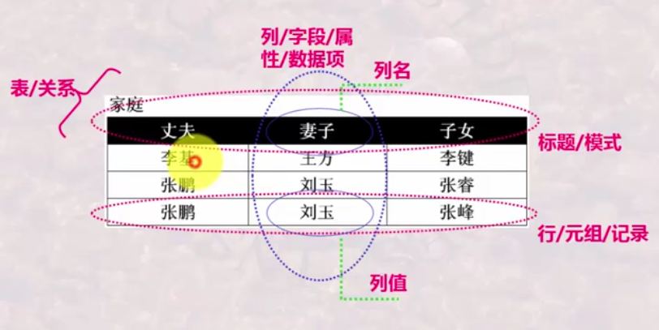
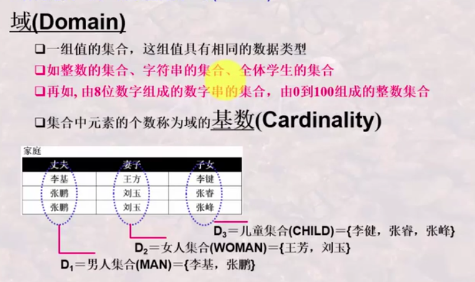
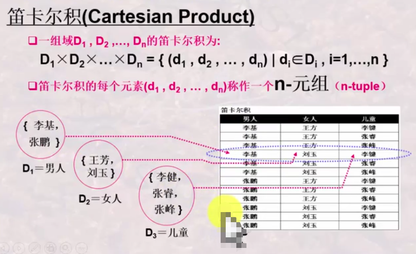
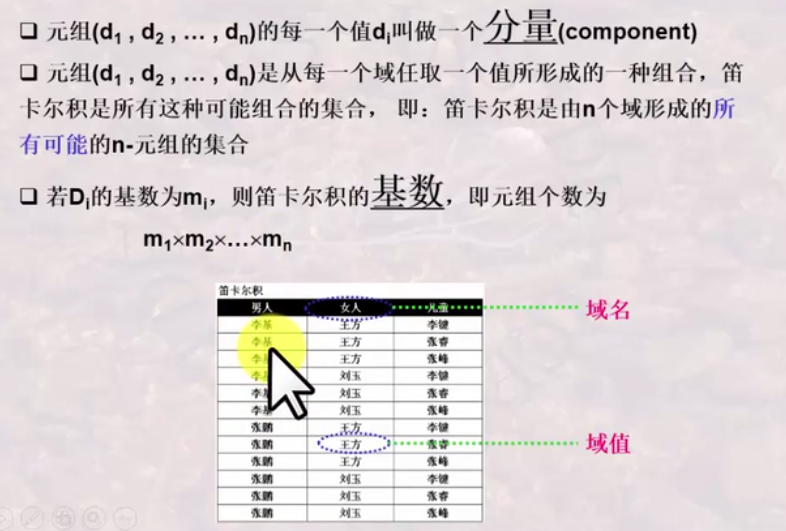
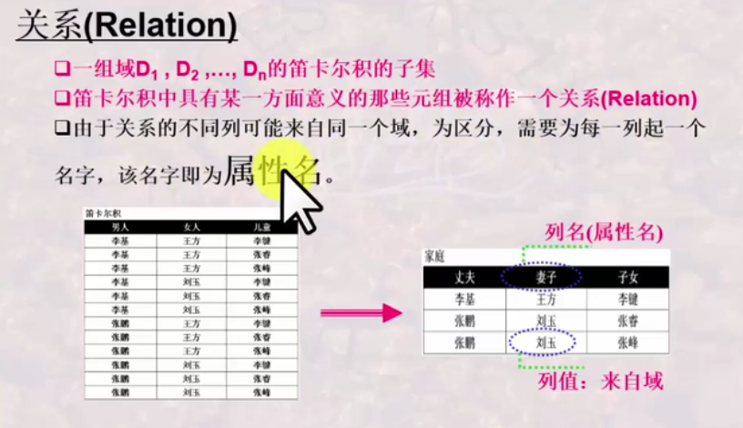
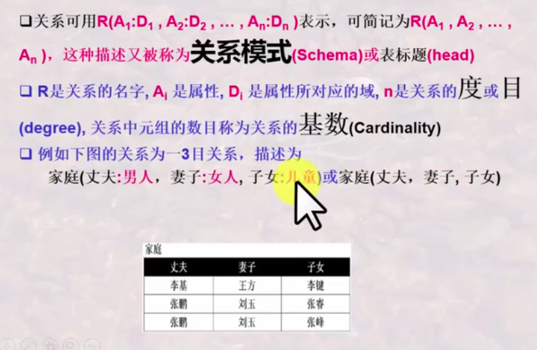
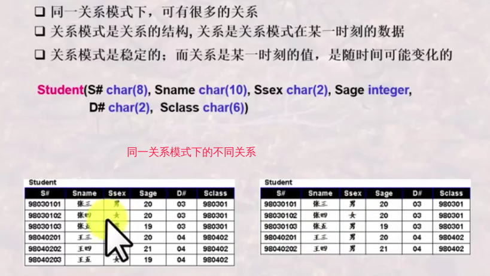
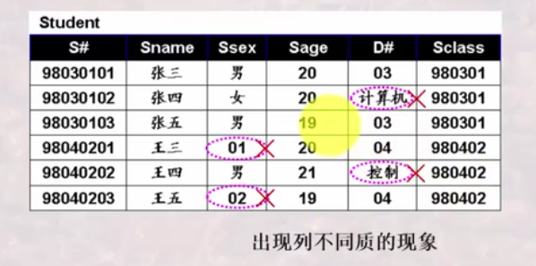
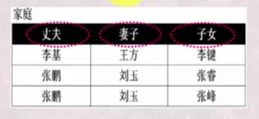

# 关系及关系的特性

## 什么是关系

### 1. 表(Table)的基本构成要素

### 2. 表的严格定义

1. 首先定义`列`的取值范围`域`

2. 再定义`元组`及所有`列`组成的可能的元组——`笛卡尔积`
所谓元组，即由不同的列值组成的一行值组合；所谓笛卡尔积，即由不同的列值组合所得的所有可能的元组的集合。

**笛卡尔积**

**关系**：笛卡尔积中有意义的组合

**关系模式**：用于表示关系的描述方式

**关系模式**与**关系**
关系是关系模式的具体表现，关系模式是关系的统一描述

## 关系的特性

- **列同质**：每一个列中的分量(值)来自同一个域，即统一列中的分量是统一类型性的数据
  
- **关系模式中，不同的列可以来自同一个域，但属性名必须不同**
  
- **行位置可以互换，列位置也可以互换**
- **关系中任意两个元组不能完全相同**：这是集合的要求，集合中不允许有相同的两个元素
- **属性不可再分**：即列不可再分为多个子列，具有原子性，这一特性又称为**关系第一范式**
