# 数据库系统的演变与发展

## 1. 简要发展史：四个阶段

- **第一阶段**
  
- **第二阶段**
  
- **第三阶段**
  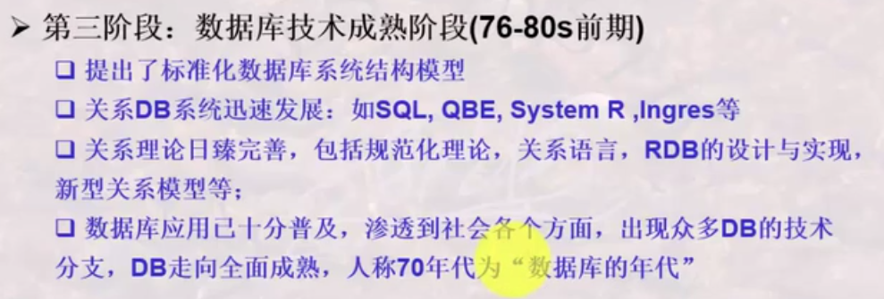
- **第四阶段**
  

## 2. 由文件系统到数据库

### 2.1 文件系统

#### 2.1.1 文件系统的简介

- **概念**：
  - 文件系统可以进行文件存储空间的管理、目录管理、文件读写管理、文件保护、向用户提供文件操作接口等
  - 文件系统提供了文件的不同村粗方法(索引文件、链接文件、直接存取文件及倒排文件等)，支持文件的基本操作(增删改查等)
  - 文件系统中，数据的存取以单个文件为基本单位，即以记录为单位
  简单地说，文件系统就是介于用户或程序与物理设备之间的桥梁，文件系统为用户或程序提供了将数据存储到物理设备上的统一接口。
- **优缺点**
  - **优点**：文件系统的存在为用户或程序省去了考虑文件存储的物理细节的步骤，即解耦了用户或程序与具体的物理设备之间的存储方式，使得用户或程序只需关心文件的存储而无需关注承载数据的物理设备是什么。
  - **缺点**：
    - **数据与程序紧密结合**：应用程序处理文件中的数据时，数据的组织及语义紧密依赖于处理该文件数据的应用程序。若是数据结构发生改变，则必须改变应用程序。
    - **文件间的数据无联系**：文件之间无联系会导致数据的共享性差、冗余度高、不一致性高等问题。

#### 2.1.2 文件系统与应用程序/用户的交互

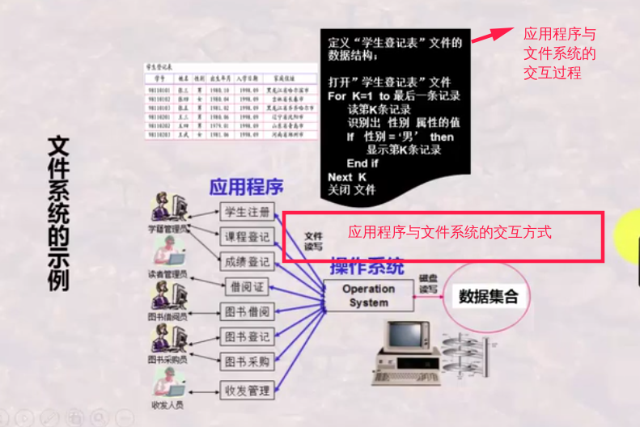
由上图可知，应用程序通过直接与文件系统交互，文件系统通过操作系统实现与物理设备进行数据的读写，从而实现应用程序对数据的管理。

### 2.2 由文件系统发展到数据库系统

**DBS中的DBAP与DBMS的交互**
在数据库系统出现之前，应用程序直接通过文件系统来完成数据的交互，其缺点是数据与程序紧密结合以及数据之间无联系。因此，为了解决应用程序与文件系统交互所带来的以上问题 ，引入了DBMS。那么，DBMS是如何解决以上问题的呢？请看下图：
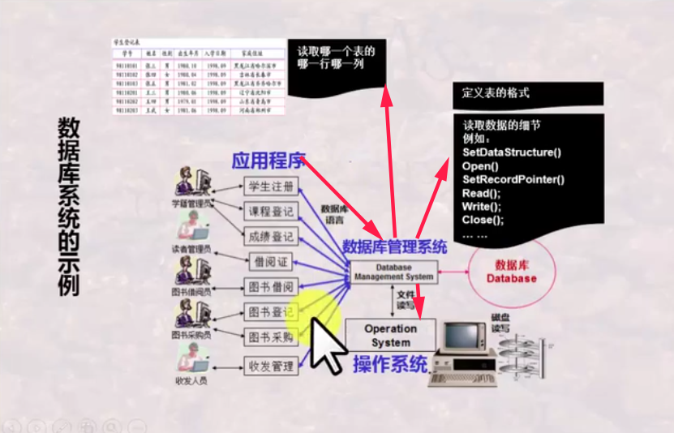
对比文件系统与应用程序的交互图可知，DBMS的解决问题的方式为：

- 通过提供一套专有的数据库语言解决应用程序与数据的数据结构间的依赖关系
- 通过特定的数据模型及不同的数据模式解决数据间的冗余性大、共享性差及不一致性高等问题
- 通过与OS进行交互实现数据的存取

**数据库系统的优点**
数据库系统解决了应用程序直接与文件系统交互所带来的一系列问题，其优点如下：

- **保证了数据与应用程序的独立性**：由DBS中的DBMS统一存取、维护数据组织形式及语义，可以使得数据独立于应用程序之外。即：**保证了数据的物理独立性与逻辑独立性**。
- **从程序中剥离数据的数据结构**：DBMS将数据及数据结构的定义与描述从应用程序中剥离开来，负责数据的数据模式的定义及数据的增删改查等操作。另外，数据存取既可以**单条记录**为单位，也可以**数据项**和**数据集和**为单位。
- **统一数据的控制功能，数据的共享性高**：DBMS可以自动检查安全性，完整性及并发操作正确性。
- **数据冗余读小，易扩展**：DBMS使得相关的整体数据结构化 ，在文件(存储数据)之间、记录之间相互有关联，从而最大程度降低数据冗余读，提供数据共享性。
- **独立于应用程序之外，便于数据的高效查询/统计操作**

## 3. 由层次模型数据库、网状模型数据库到关系模型数据库

- **第一代数据库**：层次模型数据库、网状模型数据库。
  层次模型数据库、网状模型数据库的缺点如下：
  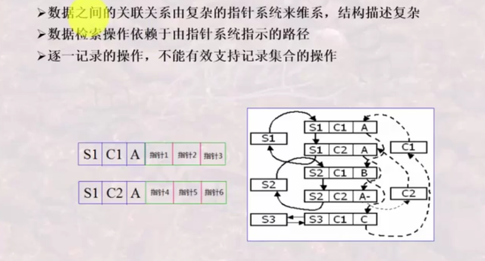
- **第二代数据库**：关系模型数据库
  发展到关系模型数据库时，针对层次模型数据库和网状模型数据库在操作上及数据组织上的不足(**主要是指针带来的复杂操作及数据结构**)，关系模型数据库的优点如下：
  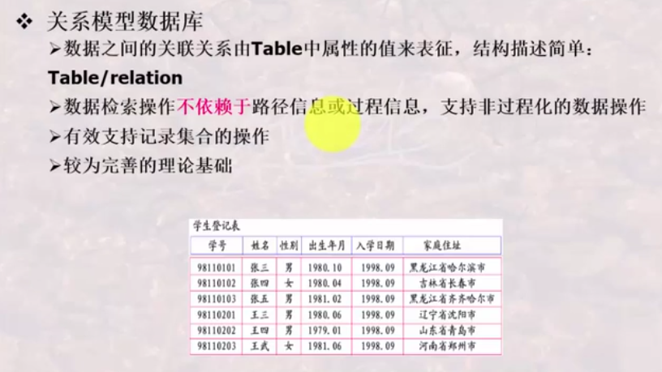
  **非过程化的数据操作**：即无需其他过程，需要什么数据就直接可以得到的操作。示例SQL：`SELECT 学号, 姓名 FROM 学生表 WHERE 性别='男';`
  **过程化的数据操作**：相对于非过程化的操作，多出来的过程可以有打开文件、关闭文件等操作。示例如下图所示：
  

## 4. 由关系数据库到对象关系数据库、面向对象数据库

- **关系模型数据库**：关系模型数据库解决了由层次模型数据库和网状模型数据库带来指针问题，其优点如下：
  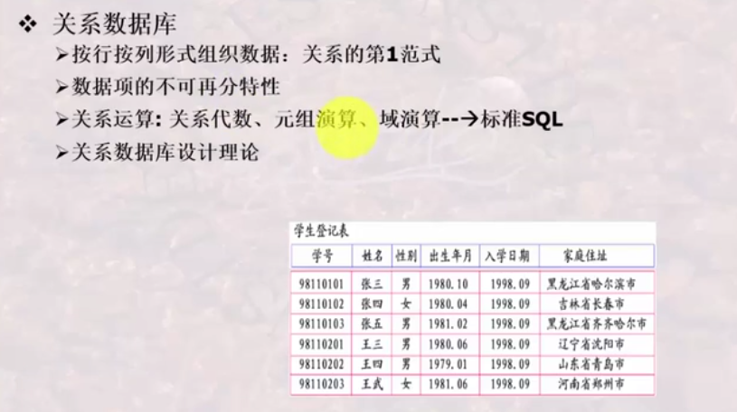
  然而，数据需求是多样化的。在许多场景下，我们并不应要求数据表中所有的数据项都不可再分；相反，我们需要某些数据项具有一定的灵活性。由此，对象关系数据库、面向对象数据库诞生。
- **对象-关系数据库**：
  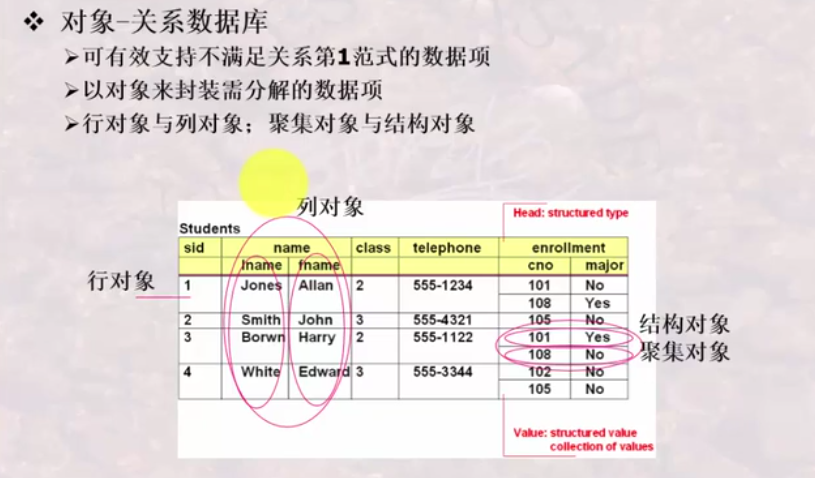
- **面向对象数据库**：
- 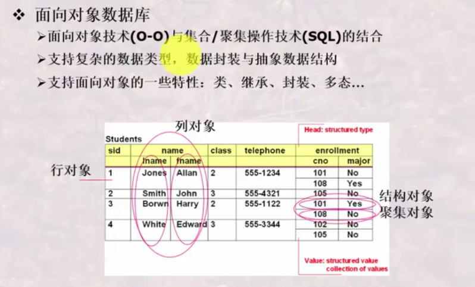

## 5. 由多种多样的数据库到多数据库的开放式互连

### 5.1 为什么会出现多数据库的开放式互连

多数据库的开放式互连的应用场景一般多出现在大型应用系统中，系统中的不同数据可能存放在不同的DB中，但是这些数据又存在联系。由此，就有了将不同的DB的数据联系在一起的需求。
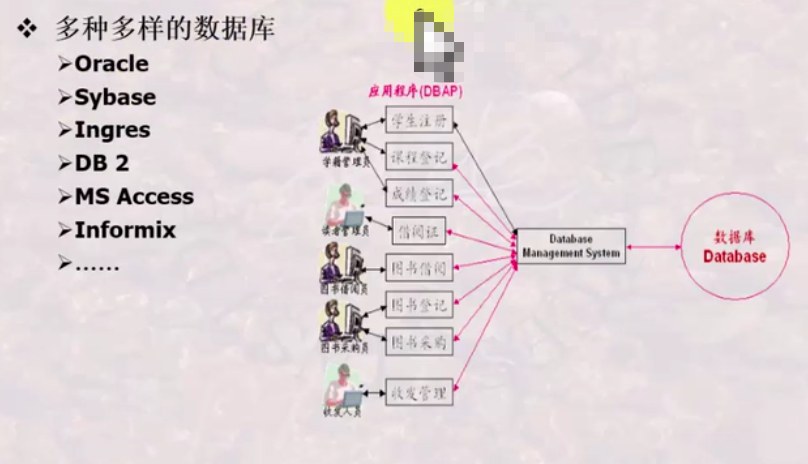

### 5.2 如何进行多数据库的开放式互连

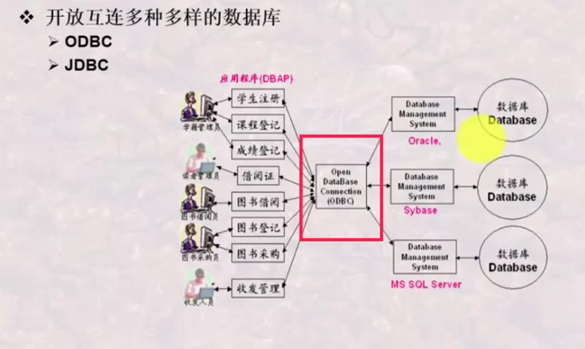

**ODBC**：多数的DB所需的Connector
**JDBC**：Java所需的DB Connector

## 6. 由普通数据库到与各种先进技术结合所形成的新型数据库

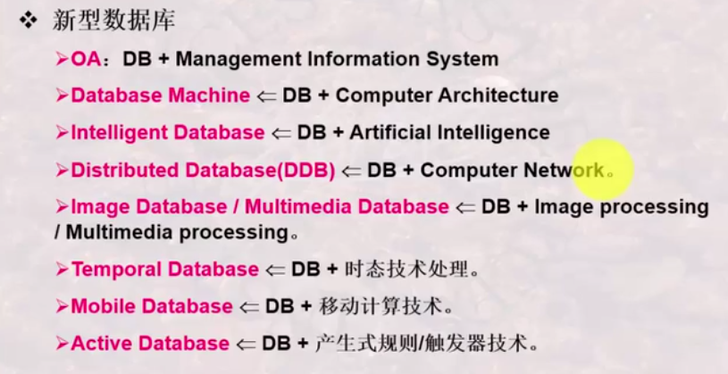
