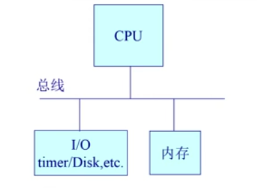

# 操作系统的启动

## 1. OS启动涉及的硬件资源

从计算机原理角度，OS启动所涉及的硬件主要是：总线、CPU、[I/O, timer/Disk]、内存

**BIOS及各个硬件在操作系统启动过程中所做的工作**：

- **总线**：用于连接电源，使得计算机通电
- **BIOS**：基本I/O处理系统，用于检查各种I/O设备是否可正常工作
- **Disk**：用于存放OS及bootloader，bootloader用于将OS从Disk加载到内存中
- **内存**：用于存放从Disk加载的OS
- **CPU**：执行已加载到内存的OS

## 2. OS启动过程

1. 总线连接电源，计算机通电开机
2. BIOS检测各种外设(I/O设备)，完成检查后才可加载软件到内存中供CPU执行
3. bootloader加载到内存中，CPU执行bootloader，并将OS从Disk加载到内存中，同时将CPU的控制权交给OS。至此，操作系统完成启动，开始各种工作。

## 3. OS与外设、应用程序的交互

在OS启动后，外设通过**中断**来与OS进行交互，应用程序通过**系统调用**实现OS服务的请求，并且在应用程序产生**异常**时由OS作出处理。

1. **系统调用**：由应用程序主动向OS发出服务请求，由OS提供相应的服务
2. **异常**：异常来源于应用程序，但并非主动产生，它来源于一些非法指令或异常的处理状态(如：内存出错)。异常产生后，通常由OS完成一些必要的工作
3. **中断**：来源于不同外设的计时器及网络的中断，外设通过中断机制通知OS需要响应的服务。外设通常是因为应用程序需要相应的I/O支持，因此通过程序的中断来等待I/O的完成。

## 4. OS的基本作用

- 在计算机运行时，OS Core是被信任的第三方软件，可以提供安全的服务，因此OS具有对整个计算机的控制权。
- 可执行特殊指令
- 为上层的应用程序提供各种不同设备的统一的调用接口，简化了应用程序对各个设备的工作

## 5. 中断、异常及系统调用的区别及特点

从三个方面分析：

- **源头**：
  - **中断**：中断是由外设发起的
  - **异常**：应用程序执行过程中出现的错误情况，如代码执行异常，属于被动行为
  - **系统调用**：应用程序主动向OS发起服务请求
- **处理时间**：
  - **中断**：异步处理
  - **异常**：同步处理
  - **系统调用**：异步或同步
- **响应**
  - **中断**：程序会持续执行，对于用户及程序是透明的
  - **异常**：可能会导致OS杀死程序或重新执行程序
  - **系统调用**：等待和持续
